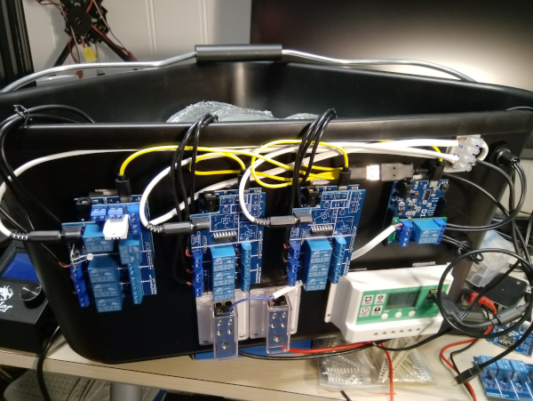

## about project

Minidrivhus (english: indoor greenhouse) started as a dedicated system for pre-cultivating seeds indoors. It was based on ESP8266 and a custom shield that could support up to 3 soil sensors 3 water pumps and sensors for temperature, humidity and light intensity. There was also a relay for controlling an external grow light, and I've made custom PCBs for small and medium-sized indoor grow lights.  
With all this in place, I also started to make an outdoor greenhouse. When it was completed I expanded the project to also support outdoor greenhouse, which meant I had to add a relay to turn on and off a fan, sensors for outdoor temperature and humidity, a relay for operating a valve controlling water flow to an intermediate water reservoir, sensors for low and high level of water in this reservoir and voltage sensor for the solar panel charged 12V car battery that would power the whole system.  
Unfortunately, the first set of soil sensors did not handle humid/wet environment very well and the second (waterproof) soil sensor had a very limited value range, so I have now started redoing the whole system where the sensors are connected by RS-485 and the water pumps are controlled by a 16-channel multiplexer so one system can control up to 15 plants (having one channel act as an Off channel). To control this I needed more GPIO pins than the ESP8266 provided, so the new system will be based on an ESP32. Stay tuned for new and improved PCBs and source code!

## pictures

The original indoor greenhouse, ready for pre-cultivating seeds:  

Setup for the outdoor greenhouse. 3 systems, each controlling 3 water pumps, for a total of 9 buckets for plants. There is also a small controller for the main water valve and a solar charge controller  

I have 3 x 210 liter buckets for collecting rain water. The water is gravity-fed into an intermediate bucket in a corner of the greenhouse. All water pumps are located in this bucket. There are low- and high water level sensors that are used to control when a water valve is opened and water flows down from the 3 large buckets.  

A complete setup looks like this:  

..and after automatically watering plants all summer, it looks like this:  
